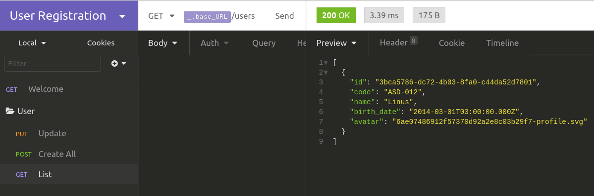

# User Registration

## :information_source: Como Rodar

Você precisará do Git, Node (recomendamos a versão estável - LTS) e Yarn. Docker e Docker Compose também irá facilitar subir o BD e o servidor.

Clone o repositório

```console
https://github.com/thiagorpereira/user-registration-api
```

Troque para a branch de ambiente local de desenvolvimento (A main está com configurações incompletas p/ subir na AWS e Armazenar uploads na S3 )

```console
git checkout feature/api_local
```

Instale as dependências

```console
yarn
```

Rode o Comando

```console
docker-compose up --build
```

Em outro Terminal, rode as Migrations

```console
yarn typeorm migration:run
```

Para facilitar o conhecimento das Rotas, importe o InsominiaUserRegistration que está na raíz do projeto no seu Insomnia.

<div align="center"></div>
